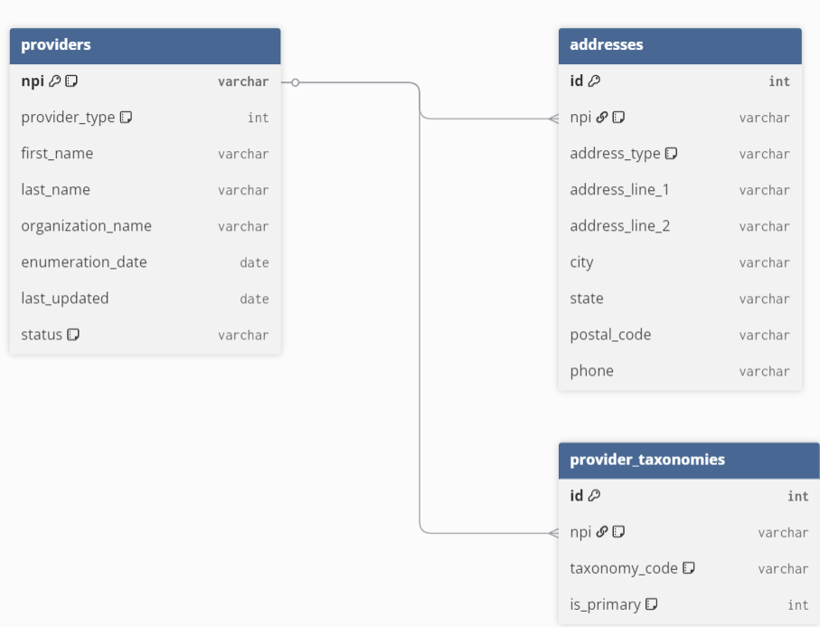

# Provider-Lookup-Task
Markdown
# Provider Lookup Database Ingestion System

A high-performance, memory-safe data engineering pipeline built in Python to stream, clean, and ingest massive National Provider Identifier (NPI) data from the Centers for Medicare & Medicaid Services (CMS) into a normalized, local relational SQLite database.

---
## Relational Database Schema

The target SQLite database (providers.db) is structured into a normalized schema optimized for relational queries and indexing:



* **providers**: Holds core identity details, distinguishing between Entity Type 1 (Individuals) and Entity Type 2 (Organizations), alongside current operational status.
* **addresses**: Maps unique primary and mailing address records directly back to an individual NPI identifier.
* **provider_taxonomies**: Acts as a relational junction tracking active healthcare provider specialty classifications.
---
## System Architecture & Data Flow

The CMS database distribution files can exceed several gigabytes in size. To maintain a lightweight hardware footprint, this system utilizes a chunk-based streaming architecture via the Python Pandas library to process row sequences iteratively without exhausting system memory.

A case-insensitive string matching matrix automatically handles the unpredictable trailing spaces or header formatting variations frequently present in CMS weekly incremental data packages.

```mermaid
flowchart TD
    A[Raw CMS NPI Data File .csv] --> B(Pandas Ingestion Stream)
    B --> C{Case-Insensitive Column Matcher}
    C -->|Core Identity Data| D[(providers table)]
    C -->|Mailing Demographics| E[(addresses table)]
    C -->|Primary Taxonomy Code| F[(provider_taxonomies table)]
    
    style A fill:#f9f,stroke:#333,stroke-width:2px
    style B fill:#bbf,stroke:#333,stroke-width:2px
    style D fill:#9f9,stroke:#333,stroke-width:2px
    style E fill:#9f9,stroke:#333,stroke-width:2px
    style F fill:#9f9,stroke:#333,stroke-width:2px
Relational Database Schema
The target SQLite database (providers.db) is structured into a normalized schema optimized for relational queries and indexing:

providers: Holds core identity details, distinguishing between Entity Type 1 (Individuals) and Entity Type 2 (Organizations), alongside current operational status.

addresses: Maps unique primary and mailing address records directly back to an individual NPI identifier.

provider_taxonomies: Acts as a relational junction tracking active healthcare provider specialty classifications.

Getting Started & Execution Order
1. Prerequisites
Ensure the core dependencies are managed within your workspace environment:

Bash
uv add pandas
2. Directory Structure
Ensure your root project layout is organized as follows:

Plaintext
├── data/
│   └── npidata_pfile_20260601-20260607.csv  # Source CMS flat file
├── create_tables.py                         # Schema Initialization Script
├── ingest_providers.py                      # Core Ingestion Engine
└── README.md                                # Project Documentation
3. Execution Pipeline
Execute the scripts sequentially from the terminal to construct the database schema and initialize data migration:

Bash
# Step 1: Initialize the SQLite structural tables
python create_tables.py

# Step 2: Stream and populate provider datasets
python ingest_providers.py
Verification & Data Validation
Upon script execution finalization, database integrity can be verified within the workspace by utilizing an SQLite viewer extension to review data row segmentation, or by executing standalone SQL query validation scripts.